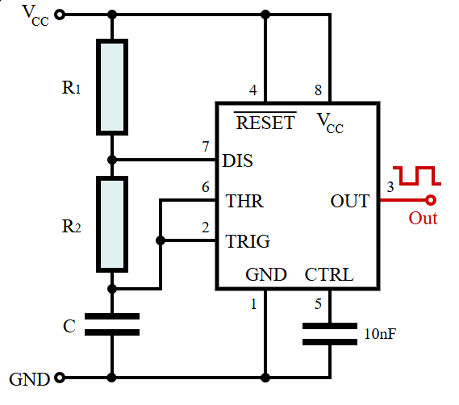
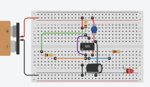
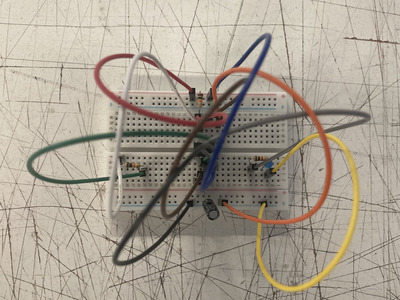
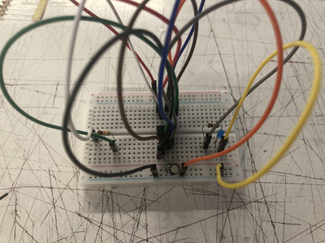
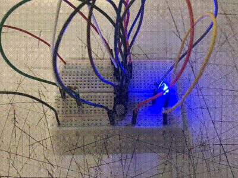
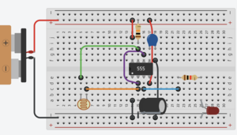

# sesion-02b

- ## circuitos 555 trabajos clase y variaciónes
- 
  - 
    - https://en.wikipedia.org/wiki/555_timer_IC#/media/File:555_Astable_Diagram.svg
      - timer chip 555
      - cada pin (8) tiene una función
        - se enumeran de abajo a la izquierda (del sacado) a contra reloj
       
- FALTAN DATOS DE ESQUEMAS Y COMPONENTES!!!! 

  - ### **ejercicios pin 555**
    - base
      - 
  - ### **en protoboard y encendido** 
    -  
    -  (este con capacitor de 1uf)
    -  (este con capacitor de 10uf)
    -  (este con capacitor de 100uf)
   
      - aqui se ve la diferencia de velocidad intermitente del LED dependiendo del capacitor
        - en el ejemplo de 1uf a traves del ojo humano se ve normal prendida
          - pero al verlo con la camara del celular se notan más los mini impulsos del LED
            - esto se debe a la velocidad de obturación de la camara que es distinta a la del ojo humano
              - si uno cambia el frame rate del video se ve un parpadeo distinto
                - buen video que explica esto
                  - https://www.youtube.com/watch?v=ft2Al-kpc4E
    - cambio tiempo real de capacitores en protoboard
      - 
        - si no mal recuerdo los electrones son flojos por lo que van más lento si hay mas espacio por el que puedan pasar
       
    - ### **potenciómetro en protoboard**
      - 
      - 
        - el potenciómetro que usamos es el B100K
          - tiene 3 pins y 100k Ω de resistencia
          - al girar la perilla se permite controlar el voltaje
    - ### **fotorresistencia en protoboard**
      - 
      - 
        - este aparato reaccióna a la luz que le llega
          - taparlo cambia el voltaje
            - cambiando el ritmo del LED
    - ### **mezcla fotorresistencia y potenciómetro**
      - 
        - tenia la duda de que ocurriria si se conectaran ambos
          - ambos controlaban el voltaje pero el fotoresistor solo hacia cambios notables con el potenciómetro en un nivel bajo
          - me falta conectar 2 o más fotoresistores para ver que se puede hacer
         
    - ### **3 LED ** 
      - 
            
            
