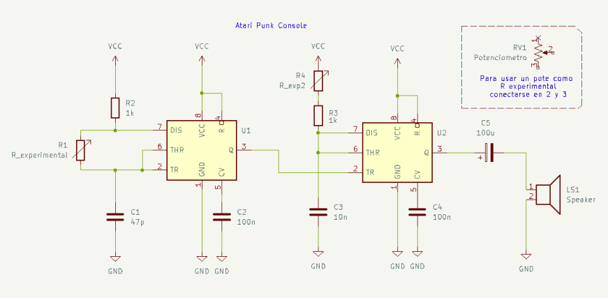
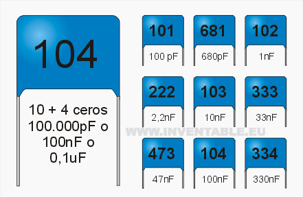

# sesion-03b

Tenemos 3 tipos de "circuitos"

- Astables
- Monostables
- Biestables

Yto Aranda: figura clave de la convergencia entre arte, naturaleza y tecnología en Latinoamérica.

---

## Desarrollo de clase 1

Intervenimos un circuito con un botón.

Aunque aún me sigue costando leer los esquemáticos, de a poco voy mejorando e hice este de forma más autónoma

Cabe destacar que lo hice otra vez mal por la lenteja...demonios

---

<https://www.digikey.com/es/resources/conversion-calculators/conversion-calculator-resistor-color-code>

Robert Forrest Mims
Radioshack
Atari Punk Console: Astable conectado a un monostable que sale a un parlante

---

## Desarrollo de clase 2

Para esta clase tuvimos que recrear este mismo circuito

Lo loco es lo mucho que fallé por errores tan simples. Gracias a quienes me ayudaron y me incluyeron 

- y si, todo se resume en conectar mal las cosas, pero al final si funcionó!

- Aunque voy a dejar esta imagen que ya compartí por Discord para la posteridad. (Son las equivalencias de las lentejas)

